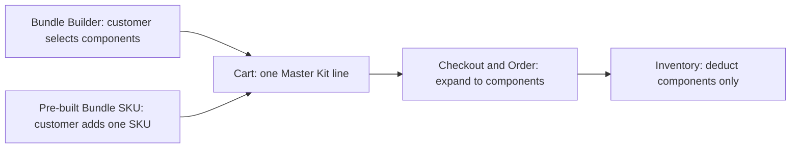

# Bundle Engine Two Purchase Paths Requirements V1

> Status: confirmed product requirement from Josh. This document records the required product scope; it does not change the V5.4 runtime authority or authorize Shopify writes, deployment, or production rollout.

## Goal

The ACES Bundle Engine must support two equally important ways for a customer to buy a bundle while preserving one shared downstream model.

It must also provide a practical path to migrate the large pre-built bundle catalogue from the current paid application and validate the new experience through a controlled product-series pilot in one store before wider adoption.

## Purchase Path A — Bundle Builder

- The customer opens the dedicated Builder page.
- The customer selects the allowed components and options.
- The selected values determine the components that will be expanded at checkout.

## Purchase Path B — Pre-built Bundle SKU

- The team defines a fixed component set and assigns it to one Shopify parent product/variant SKU.
- The customer adds that SKU through the normal product purchase path, with no component choices required.
- The assigned, published component set determines the components that will be expanded at checkout.

## Shared Rules

1. In the Cart, either purchase path remains one Master Kit parent line per bundle instance; components are not shown as separate Cart lines.
2. At Checkout and in Orders, the Master Kit expands to the correct component products.
3. Inventory deducts components only; the Master Kit is not independently stocked.
4. Bundle Metadata V1, the Option C architecture, and existing Builder-template isolation remain intact.
5. `lineUpdate`, runtime `productVariantComponents`, and client-supplied price or component authority remain prohibited.

## Acceptance Criteria

| ID | Scenario | Expected result |
| --- | --- | --- |
| TP-01 | Customer configures a kit in Bundle Builder. | Cart has one Master Kit; Checkout/Order contain the selected components; component inventory is deducted. |
| TP-02 | Customer adds a pre-built Bundle SKU without opening Builder. | Cart has one Master Kit; Checkout/Order contain that SKU's configured components; component inventory is deducted. |
| TP-03 | A customer adds multiple bundle instances through either path. | Each instance remains independently identifiable and expands only to its own components. |
| TP-04 | A pre-built SKU's bundle configuration is edited. | The change follows the draft, validation, review, publication, audit, and rollback controls required for bundle configuration. |
| TP-05 | Team imports pre-built bundles from the current application. | The import provides a reviewable mapping, validation results, per-record errors, and an explicit confirmation step before creating target records. |
| TP-06 | Team pilots one product series in one store. | Only the approved series uses the new bundle flow; its Cart, Checkout, Order, fulfillment, inventory, monitoring, and rollback criteria are accepted before wider rollout. |

## Migration and Controlled Pilot Requirements

### Machine-checkable pilot evidence

`prebuilt_bundle_pilot_acceptance.v1` is the local acceptance evidence contract.
The checker fails closed unless all of the following agree with the frozen Pilot Scope:

- Cart contains exactly one approved parent line at the ordered quantity, no separate
  component lines, and Bundle Metadata V1.
- Checkout and Order contain the exact expected component Variant quantities and the
  approved total.
- Parent inventory delta is zero and every component delta equals the negative ordered
  quantity.
- Fulfillment semantics are explicitly decided as `main_sku_only` or
  `component_level` and the observed behavior is accepted.
- A known-good rollback version, documented procedure, and regression evidence exist.

Missing evidence returns `incomplete`; observed mismatches return `failed`; malformed
Pilot Scope returns `invalid`. Only a zero-issue result returns `passed`. The checker
is local and read-only and does not retrieve Shopify data or place an order.

### Import existing pre-built bundles

- Support a migration import for the existing pre-built bundle catalogue from the current application; the expected scale is thousands of bundles.
- The import must map a source bundle to the target parent Shopify SKU and fixed component set.
- Before target records are created, the team must be able to review validation results, mapping decisions, and record-level errors.
- Import execution must be resumable and traceable, and it must not silently duplicate or overwrite an existing target bundle.

### Pilot one product series

- The first live adoption is a controlled pilot for one approved product series in one approved store.
- The pilot must be bounded to the approved products and have defined success, monitoring, rollback, and expansion criteria.
- Wider store or catalogue migration occurs only after the pilot's customer purchase, checkout, order, fulfillment, and inventory results are accepted.

## Deliberate Boundary

V5.4 production runtime remains the hard-coded Shared Core. Implementing generic pre-built SKU expansion is a future runtime capability and must be designed, validated, and approved separately before it can affect a live store.

The import and pilot requirements define the desired migration outcome; they do not themselves authorize source-app access, Shopify writes, deployment, or a live-store switch.
