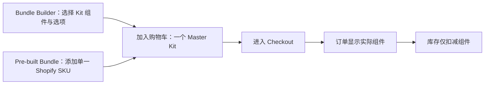

# Josh 产品愿景与功能说明（非技术版）

> 版本：2026-07-17
>
> 依据：`docs/JOSH_PROJECT_UPDATE_2026-07-16.md` 和 `Project_Master_Context_V5.4_Current_Baseline.md`。本文用产品语言描述已能确认的目标；不替代工程基线，也不把未留存的历史口头沟通当作确定需求。

## 一句话说明

Josh 想做的不是一个普通的“组合商品”页面，而是一套共享的 Bundle Engine：客户既能配置 Kit，也能直接购买预定义 Bundle SKU；运营人员能够安全维护配置；Shopify 在结账和库存层面正确处理组件。

客户可选择配置商品或直接购买预定义 Bundle SKU；运营团队看到的是一个可审查、可保存草稿、可预览的 Bundle 管理后台；订单和库存则按实际组件运作。

## 产品要解决的问题

1. 客户有两种方式购买完整 Kit：自行选择组件/选项，或直接购买已配置的单一 Shopify SKU。
2. 团队需要能在不影响正在销售配置的前提下，先编辑和检查新的 Bundle 方案。
3. 下单后的订单、履约和库存必须知道 Kit 实际包含哪些组件，避免库存扣错或订单信息不完整。
4. 配置变更必须可控：旧草稿不能覆盖新内容，不能因误操作破坏已有规则或引用关系。

## 两类用户与他们要完成的事

| 用户 | 希望完成的事 | 产品提供的能力 |
| --- | --- | --- |
| 顾客 | 自行配置 Kit，或直接购买预定义 Bundle SKU。 | Builder 提供可配置 Kit；预定义 SKU 像普通商品加入 Cart；两者均保留一个清晰的 Master Kit 条目。 |
| 商品/运营人员 | 管理 Bundle 的选项、预设和兼容规则，并在上线前确认结果。 | Bundle Admin：查看、编辑草稿、保存、校验、预览、比较版本和查看审计。 |
| 订单/仓储团队 | 看到 Kit 的实际组件，并按组件处理库存。 | 结账和订单中将 Kit 展开为组件；库存仅扣减组件。 |

## 顾客旅程

顾客在购物车不需要面对一长串拆散的零件；但在真正需要履约和库存核算的阶段，系统会提供完整组件明细。

## 运营人员旅程

## Josh 希望产品具备的核心功能

### 1. 两种客户购买入口

- **Bundle Builder**：客户在专用 Builder 页面选择组件和选项，构建自定义 Kit。
- **Pre-built Bundle SKU**：运营人员将固定组件组合绑定到单一 Shopify SKU；客户像购买普通商品一样添加该 SKU，无需选择组件。
- 两条路径在 Cart 均只显示一个 Master Kit；只有 Checkout/Order 展开为实际组件。

### 2. Bundle 配置后台

- 查看 Bundle 及其历史版本。
- 创建、复制和编辑草稿。
- 对常见设置使用简单表单，而保留高级编辑能力。
- 在正式生效前校验错误并预览结果。
- 比较草稿与其他版本的差异。

### 3. 安全的配置管理

- 保存后必须确认内容真的已保存，不能只因接口返回成功就提示成功。
- 防止过期修改覆盖更新后的 Bundle 信息。
- 保护稳定编号和规则引用：有依赖时不允许删除 Group 或 Option。
- 已发布/历史版本不应被直接编辑，草稿是唯一编辑对象。
- 能查看发布相关的审计记录。

### 4. 正确的购物车、结账与库存体验

- Builder 页面与普通组件商品页面隔离；预定义 Bundle SKU 使用正常商品购买路径，避免破坏普通组件商品购买流程。
- 每个 Kit 在 Cart 只保持一个父条目，保持购物车清晰。
- Checkout 和 Order 展示组成 Kit 的组件，支持后续履约。
- 库存只从组件扣减，避免把 Kit 和组件重复扣库存。

## 相关技术在产品中的作用

| 技术/机制 | 对产品的意义 |
| --- | --- |
| Shopify Cart Transform | 在正确的业务节点把 Kit 转换为订单所需的组件结构。 |
| Builder Theme App Extension | 提供独立的客户配置页面，避免影响普通商品页。 |
| Bundle Admin（嵌入 Shopify Admin） | 让运营人员在 Shopify 后台维护 Bundle 草稿。 |
| Revision 与 Draft | 把“编辑中”和“正在使用”分开，降低误改线上配置的风险。 |
| 校验、预览和版本比较 | 让团队在生效前发现规则、选项和兼容性问题。 |
| 读回确认与并发保护 | 防止保存失败或旧版本覆盖新版本。 |
| 审计、发布与回滚机制 | 让将来的配置上线可追踪、可验证、可恢复。 |

## 当前产品边界

### 已完成或已具备本地验证的部分

- Bundle Admin 草稿编辑、保存确认、校验、预览、比较和审计查看。
- 常用设置的受控表单编辑，以及完整 JSON 高级编辑入口。
- Cart 单一 Master Kit、Checkout/Order 组件展开、组件库存扣减这一产品模型。
- 为后续发布和回滚准备的安全保护与演练机制。

### 还不能对外承诺的部分

- 正式生产环境的发布与回滚流程尚未完成批准和真实验证。
- 2026-07-17 的一次开发店隔离演练出现 Shopify API 连接中断，恢复操作需单独评审后进行。
- 生产环境是否让可编辑配置直接驱动 Cart Transform，尚未获批；当前线上逻辑仍使用已锁定的稳定配置。

## 成功标准

从产品角度，以下结果同时满足才说明目标真正实现：

1. 顾客可顺畅地配置并购买 Kit，或直接购买预定义 Bundle SKU，购物车体验保持清晰。
2. 订单和库存准确反映实际组件。
3. 运营人员能先在草稿中修改、检查和预览，而不会误影响线上销售。
4. 团队能追溯配置变化，并在受控流程中验证发布和回滚。
5. 新能力上线不改变现有 live checkout experience，除非获得单独批准。
