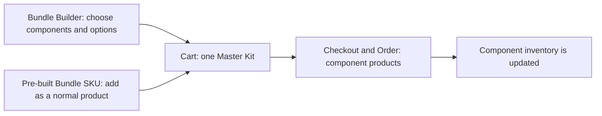

# ACES Bundle Builder — Product Vision Confirmation

## Purpose

This document confirms the intended product vision for ACES Bundle Engine: two customer purchase experiences—configurable kits and pre-built bundle SKUs—paired with a safe, practical bundle-management workflow for the team.

## Product Vision

Customers should be able to purchase a complete kit in two ways: by choosing the components and options themselves, or by adding a pre-built bundle SKU just like a normal product. In both cases, the experience should feel like buying one clear product—not manually assembling a collection of separate items.

At the same time, the ACES team should be able to manage bundle definitions confidently: prepare changes as drafts, check them before they take effect, and maintain a clear record of how a bundle is configured.

## Customer Experience

1. A customer either opens the Bundle Builder to choose components and options, or adds a pre-built bundle SKU directly to the cart.
2. Both paths add one understandable Master Kit item to the cart.
3. At checkout and in the order, the kit is represented by its actual components so fulfillment can act on the correct items.
4. Inventory is managed against the real components in the kit.

## Team Experience

The team should have a Bundle Admin workspace where they can:

- View each bundle and its version history.
- Create, copy, and edit draft bundle configurations.
- Use simple controls for common settings, while retaining an advanced configuration option when needed.
- Define available groups, options, presets, and compatibility rules.
- Validate a draft and preview the resulting bundle before it is used.
- Compare configuration versions and review the relevant audit history.
- Keep changes safe: an older edit must not overwrite a newer one, and changes must not silently break related configuration rules.

## Core Product Principles

- **Simple for customers:** choose either a configurable kit or a pre-built bundle SKU; both remain one clear kit in the cart.
- **Accurate for operations:** orders and inventory reflect the real components selected.
- **Safe for the team:** changes are prepared and checked before use, with protection against accidental overwrites or broken references.
- **Flexible where it matters:** everyday changes use straightforward controls; advanced scenarios remain possible.
- **Traceable:** the team can understand what changed and compare configurations over time.
- **Non-disruptive:** the bundle experience is isolated from the standard product experience, so ordinary component products continue to work normally.

## What Success Looks Like

The product vision is achieved when:

1. Customers can confidently buy a kit either by configuring it or by adding a pre-built bundle SKU.
2. The order and inventory accurately reflect the selected components.
3. The team can make, validate, preview, and manage bundle changes without risking unintended live changes.
4. The team has enough history and comparison information to understand and review configuration changes.

## Confirmation

Please confirm that this captures the intended product direction for ACES Bundle Builder, especially:

1. the two customer purchase paths and their one-kit cart experience;
2. component-level order and inventory accuracy; and
3. the draft-first, safe bundle-management workflow for the team.
