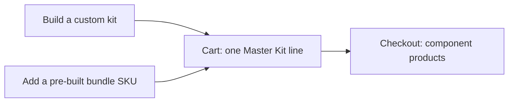

Thanks, Josh — understood and agreed. We will make both customer experiences explicit in the vision: customers can either build their own kit with the Bundle Builder or add a pre-built bundle SKU directly to the cart. In both cases, the cart keeps one Master Kit line, and the bundle expands into the correct component products at checkout.

